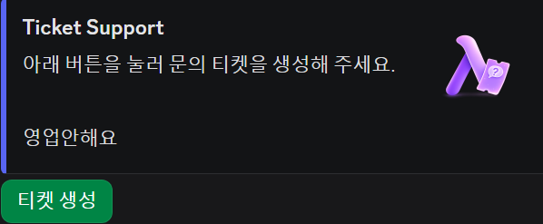
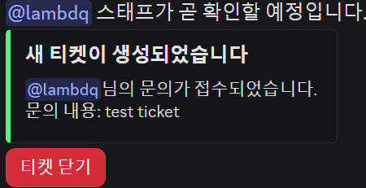
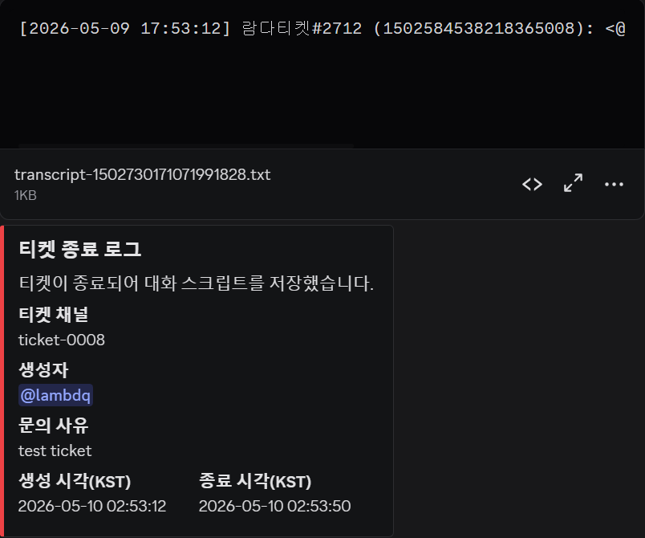

# Lambda Ticket

`discord.py` 기반의 음악 봇입니다.
## 패널 미리보기



## 실행 방법
```bash
python -m venv .venv
.venv\Scripts\activate
pip install -r requirements.txt
copy .env.example .env
```

`.env`의 `DISCORD_TOKEN` 값을 실제 봇 토큰으로 변경하세요.

## 실행
```bash
python main.py
```

## 패널 미리보기


## 구조
- `bot/commands`: 슬래시 명령어/인터랙션 라우팅
- `bot/services`: 비즈니스 로직
- `bot/database`: DB 추상화/SQLite 구현/리포지토리
- `bot/ui`: 버튼/모달 빌더
- `bot/config`: 환경변수/설정
- `bot/utils`: 임베드/권한/시간 유틸

## DB 확장 방향
현재는 SQLite(`aiosqlite`)를 사용하지만, 서비스 계층은 리포지토리를 통해 DB를 호출합니다.
나중에 MySQL/PostgreSQL로 바꿀 때는 `database` 레이어에 신규 어댑터를 추가하면 됩니다.
